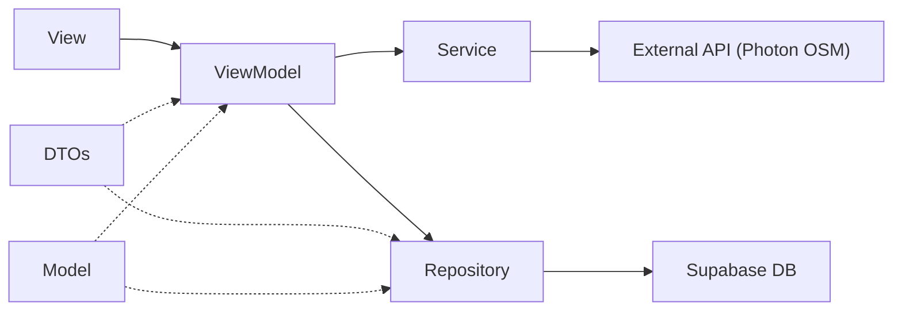

# CLAUDE.md

This file provides guidance to Claude Code (claude.ai/code) when working with code in this repository.

## Project

**BengkelIn** is a SwiftUI iOS app that connects vehicle owners with motor/car workshops ("bengkel"). It is a single Xcode project (`BengkelIn_SE.xcodeproj`) — no Swift Package Manager manifest, no CocoaPods, no fastlane. The only third-party dependency is `supabase-swift`, wired via Xcode's package manager.

The app supports three user roles that the same logged-in account can toggle between:
- **Customer** — request services, manage vehicles, claim vouchers
- **Bengkel Provider** — manage a workshop, invite/manage mechanics, accept jobs, create promos
- **Mechanic** — receive job assignments, update job status, resign from a bengkel

## Build / Run

Open in Xcode and run the `BengkelIn_SE` scheme on an iOS Simulator:

```sh
open BengkelIn_SE.xcodeproj
# or from CLI:
xcodebuild -project BengkelIn_SE.xcodeproj -scheme BengkelIn_SE \
  -destination 'platform=iOS Simulator,name=iPhone 15' build
```

All real code lives in the `BengkelIn_SE/` target. There is no lint config and no CI.

The Supabase URL and publishable key are hard-coded at the top of [`BengkelIn_SE/BengkelIn_SEApp.swift`](BengkelIn_SE/BengkelIn_SEApp.swift) as a module-level `let supabase = SupabaseClient(...)`. Every Repository and Service imports that global directly rather than receiving a client via init.

```swift
// BengkelIn_SEApp.swift — module-level constant
let supabase = SupabaseClient(
  supabaseURL: URL(string: "https://ipxwpxozreksmuiztwcy.supabase.co")!,
  supabaseKey: "sb_publishable_..."
)
```

**Info.plist requirement**: the bengkel registration map uses GPS, so `NSLocationWhenInUseUsageDescription` (Privacy - Location When In Use Usage Description) must be set in the target's Info settings.

---

## Architecture (Layered MVVM)

This project uses a **layered MVVM** architecture. All layers live under `BengkelIn_SE/`:



| Layer | Folder | Role | Depends On |
|-------|--------|------|------------|
| **Model** | `Models/` | Domain entity structs matching DB schema (`Codable + Identifiable`) | Foundation |
| **DTO** | `Models/DTOs/` | `Encodable`/`Decodable` payloads for insert/update/response — **never** inline structs in ViewModels | Models |
| **Protocol** | `Protocols/` | Shared behavior contracts (e.g. `LocationSearchable`) | Models |
| **Repository** | `Repositories/` | Single-purpose Supabase **database** CRUD calls (`supabase.from("table")`) | DTOs, Models, `supabase` global |
| **Service** | `Services/` | External API / SDK calls **not** tied to a Supabase table (Auth SDK, Storage, Photon OSM) | DTOs, `supabase` global |
| **ViewModel** | `ViewModels/` | Orchestrates Repository + Service; holds `@Published` UI state; **never** calls `supabase` directly | Repositories, Services, DTOs, Models |
| **View** | `Views/` | SwiftUI views — Pages (full screens) and Components (reusable) | ViewModels |

### Key Rules

1. **ViewModels never touch `supabase` directly** — all DB operations go through a Repository, all SDK/API operations go through a Service. The only exception is realtime channel setup in `MechanicViewModel` (the Supabase Swift SDK requires the channel API to be called from the consumer).
2. **No inline `Encodable` structs in ViewModels** — always use a named DTO from `Models/DTOs/`.
3. **Models are pure data** — `Codable + Identifiable` structs with `CodingKeys` for snake_case mapping. No business logic, no co-located DTOs.
4. **Repositories are stateless** — they receive parameters and return/throw. No `@Published` properties.
5. **Services are stateless** — same as Repositories but for non-DB operations.
6. **ViewModels are `@MainActor`** — annotated `@MainActor` (either explicitly or via the `NSObject` + `CLLocationManagerDelegate` pattern used by `BengkelViewModel`) and use `ObservableObject` with `@Published` properties.

---

## Supabase Usage Conventions

### User ID Convention

The user PK is the Supabase `auth.user.id` UUID, **lowercased**:

```swift
let uid = session.user.id.uuidString.lowercased()
```

Always use `.lowercased()` when filtering by user ID.

### Tables Touched

| Table | Repository | Description |
|-------|-----------|-------------|
| `users` | `UserRepository` | User profile (name, role, profile image, balance) |
| `vehicles` | `VehicleRepository` | Customer vehicles |
| `bengkels` | `BengkelRepository` | Workshop records with JSONB `offered_services` and `mechanic_uids` array |
| `service_requests` | `ServiceRequestRepository` | Customer service/job requests (the BengkelIn "order" record) |
| `mechanic_invitations` | `MechanicInvitationRepository` | Provider → mechanic invitations |
| `mechanic_resignations` | `MechanicResignationRepository` | Mechanic → provider resignation requests |
| `vouchers` | `VoucherRepository` | Promo codes (global or provider-scoped) |
| `user_vouchers` | `VoucherRepository` | Per-user claimed-voucher wallet (join target on `vouchers`) |

### Storage Buckets

| Bucket | Service | Usage |
|--------|---------|-------|
| `avatars` | `StorageService` | Profile image uploads (`{uid}/profile.jpg`) |

### Auth Conventions

- Sign-up writes `name` and `phone_number` into `auth.users.user_metadata`. The `users` row itself is created by a Postgres trigger.
- `fetchUser()` merges metadata onto the row from the `users` table.
- Account deletion re-authenticates with password before deleting the `users` row, then signs out. The auth user itself is not deleted from the client.
- Bengkel deletion and mechanic resignation both **re-authenticate with password** before mutating, as a confirmation step.

### Supabase RPCs

| RPC | Used By | Purpose |
|-----|---------|---------|
| `get_user_by_email` | `UserRepository.lookupByEmail` | Resolve an email address to `{user_id, user_name}` (used by mechanic invitation flow) |
| `get_my_bengkel` | `BengkelRepository.fetchMyBengkelRPC` | Fetch the caller's linked bengkel (used by mechanic-side flows where direct SELECT is restricted by RLS) |
| `accept_mechanic_invite` | `MechanicInvitationRepository.acceptInviteRPC` | Atomically: set invitation status, set `users.role = 'MECHANIC'`, append uid to `bengkels.mechanic_uids` |
| `reject_mechanic_invite` | `MechanicInvitationRepository.rejectInviteRPC` | Mark invitation as rejected |
| `approve_mechanic_resignation` | `MechanicResignationRepository.approveResignationRPC` | Atomically: set resignation status, remove uid from `bengkels.mechanic_uids`, reset `users.role` |

### Realtime Subscriptions

`MechanicViewModel.subscribeToRequestUpdates(requestId:userId:)` watches `service_requests` for the single active request:

```swift
let channel = supabase.channel("service_request_\(requestId)")
let changes = channel.postgresChange(UpdateAction.self, schema: "public",
                                     table: "service_requests",
                                     filter: "id=eq.\(requestId)")
Task {
    await channel.subscribe()
    for await change in changes {
        let updated = try change.decodeRecord(as: ServiceRequest.self, decoder: ServiceRequest.decoder)
        // ... merge into @Published state
    }
}
```

The channel is torn down in `deinit` and in `teardownRealtime()`. Use this pattern when adding more realtime watchers.

---

## App Entry & Session Flow

[`BengkelIn_SEApp`](BengkelIn_SE/BengkelIn_SEApp.swift) → [`ContentView`](BengkelIn_SE/ContentView.swift) owns the single `@StateObject AuthViewModel`.

`ContentView` gates on `authViewModel.userSession`:
- **nil** → shows `LoginView`
- **non-nil** → shows a 4-tab `TabView`:
  1. Dashboard
  2. Payment (placeholder)
  3. History (placeholder)
  4. Profile

`AuthViewModel` exposes `appMode: AppMode { .customer, .bengkel, .mechanic }`. A floating top-right role-switcher menu (rendered in `ContentView`) lets a user with the appropriate flags (`isBengkelProvider` or `currentUser.role == "MECHANIC"`) flip modes. `DashboardView` switches its content based on `appMode`.

`AuthViewModel.isBengkelProvider` is derived from `BengkelRepository.countByProvider(uid:)` during `fetchUser()`.

---

## Location / Map Stack (Bengkel Registration)

**Stack**: OpenStreetMap tiles + Photon API (`photon.komoot.io`) for geocoding. **No Apple MapKit search or Google Maps.** `MKLocalSearch` is not used.

### Components

- [`OSMMapView`](BengkelIn_SE/Views/Components/Features/Bengkel/Location/OSMMapView.swift) — `UIViewRepresentable` wrapping `MKMapView` with an OSM tile overlay. Reports debounced region-change events.
- [`LocationInputCard`](BengkelIn_SE/Views/Components/Features/Bengkel/Location/LocationInputCard.swift) — Tappable address display + "use current location" button. Binding-based, reusable.
- [`LocationSearchView<VM: LocationSearchable>`](BengkelIn_SE/Views/Components/Features/Bengkel/Location/LocationSearchView.swift) — Generic search overlay driven by any `LocationSearchable` ViewModel.
- [`LocationService`](BengkelIn_SE/Services/LocationService.swift) — Photon API: `searchOSM(query:coordinate:)` and `fetchAddress(from:)`.

### `LocationSearchable` Protocol

Shared contract for any ViewModel that drives the map + search address picker. Defined in [`Protocols/LocationSearchable.swift`](BengkelIn_SE/Protocols/LocationSearchable.swift):

```swift
@MainActor
protocol LocationSearchable: ObservableObject {
    var locationAddress: String { get set }
    var isEditingLocation: Bool { get set }
    var isFetchingLocation: Bool { get }
    var searchResults: [PhotonSearchFeature] { get set }
    var region: MKCoordinateRegion { get set }

    func useCurrentLocation()
    func selectSearchResult(_ result: PhotonSearchFeature)
    func updateLocationFromMap(coordinate: CLLocationCoordinate2D)
}
```

`BengkelViewModel` is the only conformer today. Any future map+picker ViewModel should conform too.

### Location ViewModel Pattern

ViewModels with map support follow this pattern (see `BengkelViewModel`):
1. Inherit `NSObject`, conform to `CLLocationManagerDelegate` + `LocationSearchable`
2. Own a `CLLocationManager` + `LocationService`
3. Debounce `$locationAddress` via Combine (400ms) for live Photon search
4. GPS flow: `useCurrentLocation()` → authorization check → `requestLocation()` → delegate callback → reverse geocode
5. Map-pan flow: `updateLocationFromMap(coordinate:)` → reverse geocode via `LocationService.fetchAddress(from:)`

The user-entered address goes to the DB as-is; **coordinates come from `region.center`**, not from geocoding the address string.

---

## Directory Structure

```
BengkelIn_SE/
├── BengkelIn_SEApp.swift              # @main, global supabase client, AppDelegate
├── ContentView.swift                  # Session gate → Login or TabView with role switcher
│
├── Models/
│   ├── User.swift                     # users table
│   ├── Vehicle.swift                  # vehicles table
│   ├── Bengkel.swift                  # bengkels table (JSONB offered_services + mechanic_uids array)
│   ├── BengkelService.swift           # ServiceType enum + BengkelService struct
│   ├── Mechanic.swift                 # local mechanic display struct + MechanicStatus enum
│   ├── ServiceRequest.swift           # service_requests table + ServiceRequestStatus enum
│   ├── MechanicInvitation.swift       # mechanic_invitations table + InvitationStatus + display join
│   ├── MechanicResignation.swift      # mechanic_resignations table + nested users(name)
│   ├── Voucher.swift                  # vouchers + UserVoucher (with embedded vouchers join)
│   ├── VoucherClaim.swift             # legacy claim status enum
│   ├── PhotonSearchResponse.swift     # Photon OSM geocoding response
│   └── DTOs/
│       ├── AuthDTOs.swift             # SignUpRequest, ProfileUpdatePayload, ProfileImageUpdatePayload, UserLookupResponse
│       ├── VehicleDTOs.swift          # VehicleUpdatePayload
│       ├── BengkelDTOs.swift          # BengkelUpdatePayload, BengkelMechanicsUpdatePayload
│       ├── ServiceRequestDTOs.swift   # ServiceRequestInsert, ServiceRequestStatusUpdate
│       ├── VoucherDTOs.swift          # VoucherInsertPayload, UserVoucherInsert
│       ├── MechanicInvitationDTOs.swift  # MechanicInvitationInsert, MechanicInvitationStatusUpdate
│       └── MechanicResignationDTOs.swift # MechanicResignationInsert
│
├── Protocols/
│   └── LocationSearchable.swift       # Shared protocol for map+search ViewModels
│
├── Repositories/
│   ├── UserRepository.swift           # CRUD on users + email lookup RPC
│   ├── VehicleRepository.swift        # CRUD on vehicles
│   ├── BengkelRepository.swift        # CRUD on bengkels + get_my_bengkel RPC
│   ├── ServiceRequestRepository.swift # CRUD on service_requests (customer/mechanic/bengkel scopes)
│   ├── VoucherRepository.swift        # CRUD on vouchers + user_vouchers
│   ├── MechanicInvitationRepository.swift  # CRUD + accept/reject RPCs
│   └── MechanicResignationRepository.swift # CRUD + approve RPC
│
├── Services/
│   ├── AuthService.swift              # Supabase Auth SDK wrapper
│   ├── StorageService.swift           # Supabase Storage wrapper (avatars)
│   └── LocationService.swift          # Photon OSM search + reverse geocode
│
├── Utils/
│   └── Double+Currency.swift          # toRupiah() formatter
│
├── ViewModels/
│   ├── AuthViewModel.swift            # Login/signup/session/delete, owns appMode + isBengkelProvider
│   ├── ProfileViewModel.swift         # Update profile, upload avatar
│   ├── VehicleViewModel.swift         # CRUD vehicles
│   ├── BengkelViewModel.swift         # Bengkel CRUD + LocationSearchable + services + team/invitations/resignations + promos + service-request job lifecycle
│   ├── MechanicViewModel.swift        # Customer-side fetch/create requests, mechanic-side assigned tasks, provider-side incoming, realtime
│   ├── MechanicProfileViewModel.swift # Mechanic's own bengkel (RPC) + resignation submission
│   ├── InvitationViewModel.swift      # Mechanic accepting/rejecting invitations
│   └── VoucherViewModel.swift         # Available vouchers, wallet, claim by id/code
│
└── Views/
    ├── Components/
    │   ├── StatBox.swift              # Metric display card (root-level, generic)
    │   └── Features/
    │       ├── AuthAndProfile/
    │       │   ├── CustomInputField.swift  # Icon + TextField/SecureField
    │       │   ├── ActionRow.swift         # Tappable row with chevron
    │       │   ├── DangerRow.swift         # Destructive action row
    │       │   └── VehicleCardRow.swift    # Vehicle list item with edit/delete
    │       └── Bengkel/
    │           ├── Dashboard/
    │           │   └── StarRatingView.swift  # Fractional star rating
    │           └── Location/
    │               ├── OSMMapView.swift          # UIViewRepresentable OSM map
    │               ├── LocationInputCard.swift   # Address display + current location button
    │               └── LocationSearchView.swift  # Generic<VM: LocationSearchable> search overlay
    │
    └── Pages/
        ├── Authentication/
        │   ├── LoginView.swift
        │   └── RegistrationView.swift
        ├── Dashboard/
        │   └── DashboardView.swift          # Switches on AuthViewModel.appMode
        ├── Profile/
        │   ├── ProfileView.swift
        │   ├── UpdateProfileView.swift
        │   └── VehicleFormView.swift
        ├── Bengkel/
        │   ├── RegisterBengkelView.swift    # Map picker + register
        │   ├── UpdateBengkelView.swift      # Map picker + edit
        │   ├── BengkelDashboardView.swift
        │   ├── BengkelProfileView.swift
        │   ├── BengkelServiceFormView.swift
        │   ├── MechanicPickerView.swift     # Dispatch a mechanic to a job
        │   ├── CreatePromoSheet.swift
        │   ├── CreateVoucherView.swift
        │   └── ManageVouchersView.swift
        ├── Mechanic/
        │   ├── CreateOrderView.swift        # Customer creates a service request
        │   ├── WaitingForMechanicView.swift # Customer waits for acceptance (realtime)
        │   ├── MechanicDashboardView.swift  # Mechanic's assigned tasks
        │   ├── MechanicProfileView.swift    # Mechanic's bengkel + resign button
        │   ├── InvitationsView.swift        # Mechanic's pending invitations
        │   └── TaskDetailView.swift
        ├── Voucher/
        │   ├── VoucherListView.swift
        │   ├── VoucherDetailView.swift
        │   ├── VoucherEntryView.swift       # Manual code entry
        │   └── VoucherDiagnosticsView.swift # Temporary E2E test harness (uses supabase directly)
        ├── History/                         # Empty — placeholder
        ├── Payment/                         # Empty — placeholder
        └── Temp Placeholder/
            └── PaymentPlaceholderView.swift # Defines both Payment + History placeholder views
```

---

## Coding Conventions & Patterns

### Model Pattern

```swift
import Foundation

struct ModelName: Codable, Identifiable {
    var id: String?            // Optional for insert (server-generated)
    var foreignKeyId: String   // camelCase in Swift
    var fieldName: String
    var createdAt: Date?       // Optional, server-managed

    enum CodingKeys: String, CodingKey {
        case id
        case foreignKeyId = "foreign_key_id"
        case fieldName    = "field_name"
        case createdAt    = "created_at"
    }
}
```

**Rules**:
- All properties are `var` (not `let`) — needed for mutation after fetch
- Use `CodingKeys` to map camelCase Swift → snake_case Postgres
- `id` and `createdAt` are optional for inserts
- `Identifiable` conformance via `id`
- **No DTOs co-located with the model** — DTOs go in `Models/DTOs/{Feature}DTOs.swift`

### DTO Pattern

```swift
import Foundation

// Purpose comment explaining which Repository/Service uses it
struct PayloadName: Encodable {
    let field_name: String     // snake_case to match DB column directly
}
```

**Rules**:
- DTOs use `let` (immutable after construction)
- Field names are **snake_case** (matching DB columns directly) — no CodingKeys needed
- Insert payloads usually use the Model type directly; lean insert DTOs are fine when the model has many server-managed fields (see `ServiceRequestInsert`)
- Update payloads: always a dedicated DTO with only the updatable fields
- Request DTOs that don't go to DB use camelCase (e.g. `SignUpRequest`)

### Repository Pattern

```swift
import Foundation
import Supabase

class RepositoryName {
    func fetchItem(filterParam: String) async throws -> ModelType {
        return try await supabase.from("table_name")
            .select()
            .eq("column", value: filterParam)
            .single()
            .execute()
            .value
    }

    func insertItem(_ item: ModelType) async throws {
        try await supabase.from("table_name")
            .insert(item)
            .execute()
    }

    func updateItem(itemId: String, payload: PayloadType) async throws {
        try await supabase.from("table_name")
            .update(payload)
            .eq("id", value: itemId)
            .execute()
    }

    func deleteItem(itemId: String) async throws {
        try await supabase.from("table_name")
            .delete()
            .eq("id", value: itemId)
            .execute()
    }
}
```

**Rules**:
- One repository per DB table (RPCs that operate on a table live in that table's repository)
- Methods are `async throws` — no error handling here (ViewModel handles it)
- Use the global `supabase` client directly
- Return decoded values using `.value` (Supabase Swift SDK auto-decoding)
- For single records: `.single().execute().value`
- For arrays: `.execute().value` (returns `[ModelType]`)

### Service Pattern

```swift
import Foundation
import Supabase

class ServiceName {
    func performAction(param: ParamType) async throws -> ReturnType {
        // Call external API or Supabase SDK (not .from("table"))
    }
}
```

**Rules**:
- Same stateless pattern as Repository
- Used for: Auth SDK calls (`AuthService`), Storage uploads (`StorageService`), external HTTP APIs (`LocationService`)
- Never calls `supabase.from("table")` — that's a Repository's job

### ViewModel Pattern

```swift
import SwiftUI
import Combine
import Supabase

@MainActor
class FeatureViewModel: ObservableObject {
    // Published UI state
    @Published var items: [Item] = []
    @Published var isLoading = false
    @Published var errorMessage: String?
    @Published var successMessage: String?

    // Private dependencies
    private let authService = AuthService()
    private let itemRepository = ItemRepository()

    func fetchItems() async {
        guard let session = try? await authService.getCurrentSession() else { return }
        let uid = session.user.id.uuidString.lowercased()

        do {
            let fetched = try await itemRepository.fetchItems(userId: uid)
            self.items = fetched
        } catch {
            self.errorMessage = error.localizedDescription
        }
    }

    func createItem(...) async -> Bool {
        isLoading = true
        errorMessage = nil

        do {
            try await itemRepository.insertItem(newItem)
            await fetchItems()
            isLoading = false
            return true
        } catch {
            self.errorMessage = error.localizedDescription
            isLoading = false
            return false
        }
    }
}
```

**Rules**:
- Always `@MainActor`
- Dependencies instantiated as `private let` properties
- Get current session via `authService.getCurrentSession()` — never via `supabase.auth.session`
- Mutating operations return `Bool` for success/failure
- Always set `isLoading = true` at start, `false` at end
- Always clear `errorMessage = nil` at start of operations
- Error handling: catch → assign `self.errorMessage = error.localizedDescription`
- After mutations, re-fetch to refresh the list
- Never reference `supabase` directly — except realtime channel setup, which has no Repository wrapper

### View Pattern

```swift
import SwiftUI

struct FeatureView: View {
    @StateObject private var viewModel = FeatureViewModel()    // owns
    // OR
    @ObservedObject var viewModel: FeatureViewModel            // received

    var body: some View {
        // ... UI
    }
}
```

**Rules**:
- Use `@StateObject` when the View creates the ViewModel
- Use `@ObservedObject` when receiving from parent
- `AuthViewModel` is always received (created once in `ContentView`)
- Feature-specific ViewModels are typically created with `@StateObject`

### UI Component Conventions

- **Background colors**: `Color(.systemGray6)` for cards/inputs, `Color(.systemBackground)` for backgrounds
- **Corner radius**: 12pt for cards/inputs, 16pt for buttons, 20pt for modals
- **Shadows**: `Color.black.opacity(0.05–0.08), radius: 5–10` for subtle elevation
- **Primary color**: `.primary` for text and dark buttons, `.primary.opacity(0.9)` for button backgrounds
- **Button style**: Full-width with `Color.primary.opacity(0.9)` background, `Color(.systemBackground)` text
- **Language**: UI text mixes English and Indonesian (Bahasa Indonesia) — match the surrounding screen when adding text

### File Header

```swift
//
//  FileName.swift
//  BengkelIn_SE
//
//  Created by Author Name on DD/MM/YY.
//
```

---

## Supabase Database Schema Reference

### `users` table
| Column | Type | Notes |
|--------|------|-------|
| `id` | UUID (PK) | Matches `auth.users.id` |
| `name` | text | |
| `profile_image_url` | text? | |
| `balance` | double? | |
| `role` | text? | `"MECHANIC"` flags a mechanic account; provider role is derived from owning a bengkel |
| `is_mechanic` | bool? | Legacy flag |
| `is_provider` | bool? | Legacy flag |

### `vehicles` table
| Column | Type | Notes |
|--------|------|-------|
| `id` | UUID (PK) | Server-generated |
| `customer_id` | UUID (FK→users) | |
| `manufacturer`, `model`, `year`, `license_plate`, `color` | — | |
| `created_at` | timestamp | |

### `bengkels` table
| Column | Type | Notes |
|--------|------|-------|
| `id` | UUID (PK) | Server-generated |
| `provider_uid` | UUID (FK→users) | |
| `name`, `address`, `latitude`, `longitude` | — | |
| `status` | text | `"Pending"` or `"Verified"` |
| `offered_services` | JSONB | Array of `BengkelService` |
| `mechanic_uids` | UUID[] | Array of linked mechanic user IDs |
| `average_rating` | double? | |
| `total_reviews` | int? | |
| `created_at` | timestamp | |

### `service_requests` table
| Column | Type | Notes |
|--------|------|-------|
| `id` | UUID (PK) | Server-generated |
| `customer_id` | UUID (FK→users) | |
| `vehicle_id` | UUID (FK→vehicles) | |
| `bengkel_id` | UUID (FK→bengkels) | |
| `mechanic_id` | UUID? (FK→users) | Set when a mechanic is dispatched |
| `service_type` | text | |
| `description` | text? | |
| `is_emergency` | bool | |
| `location`, `latitude`, `longitude` | — | |
| `estimated_price` | double? | |
| `status` | text | `pending`/`accepted`/`in_progress`/`completed`/`cancelled` |
| `mechanic_notes` | text? | |
| `created_at`, `updated_at` | timestamp | |

### `mechanic_invitations` table
| Column | Type | Notes |
|--------|------|-------|
| `id` | UUID (PK) | |
| `bengkel_id` | UUID (FK→bengkels) | |
| `mechanic_id` | UUID (FK→users) | |
| `status` | text | `pending`/`accepted`/`rejected` |
| `created_at` | timestamp | |

### `mechanic_resignations` table
| Column | Type | Notes |
|--------|------|-------|
| `id` | UUID (PK) | |
| `bengkel_id` | UUID (FK→bengkels) | |
| `mechanic_id` | UUID (FK→users) | |
| `status` | text | `pending`/`approved` |
| `created_at` | timestamp | |

### `vouchers` table
| Column | Type | Notes |
|--------|------|-------|
| `id` | UUID (PK) | |
| `code`, `title` | text? | |
| `discount_amount` | double? | |
| `valid_until` | timestamp? | |
| `provider_uid` | UUID? | If set, voucher is scoped to that provider's bengkel(s) |
| `created_at` | timestamp | |

### `user_vouchers` table
| Column | Type | Notes |
|--------|------|-------|
| `id` | UUID (PK) | |
| `user_id` | UUID (FK→users) | |
| `voucher_id` | UUID (FK→vouchers) | |
| `is_used` | bool | |
| `created_at` | timestamp | |
| `vouchers` | join | Populated by `.select("*, vouchers(*)")` |

---

## Known Patterns Not Yet Fully Extracted

- [`Views/Pages/Voucher/VoucherDiagnosticsView.swift`](BengkelIn_SE/Views/Pages/Voucher/VoucherDiagnosticsView.swift) is an explicit temporary E2E test harness with its own diagnostic DTOs and direct `supabase.from(...)` calls. Its file header says to delete it after testing.
- The `service_requests` table is described in some places as the BengkelIn "order" (e.g. `CreateOrderView` lives under `Views/Pages/Mechanic/`). There is no separate orders table.
