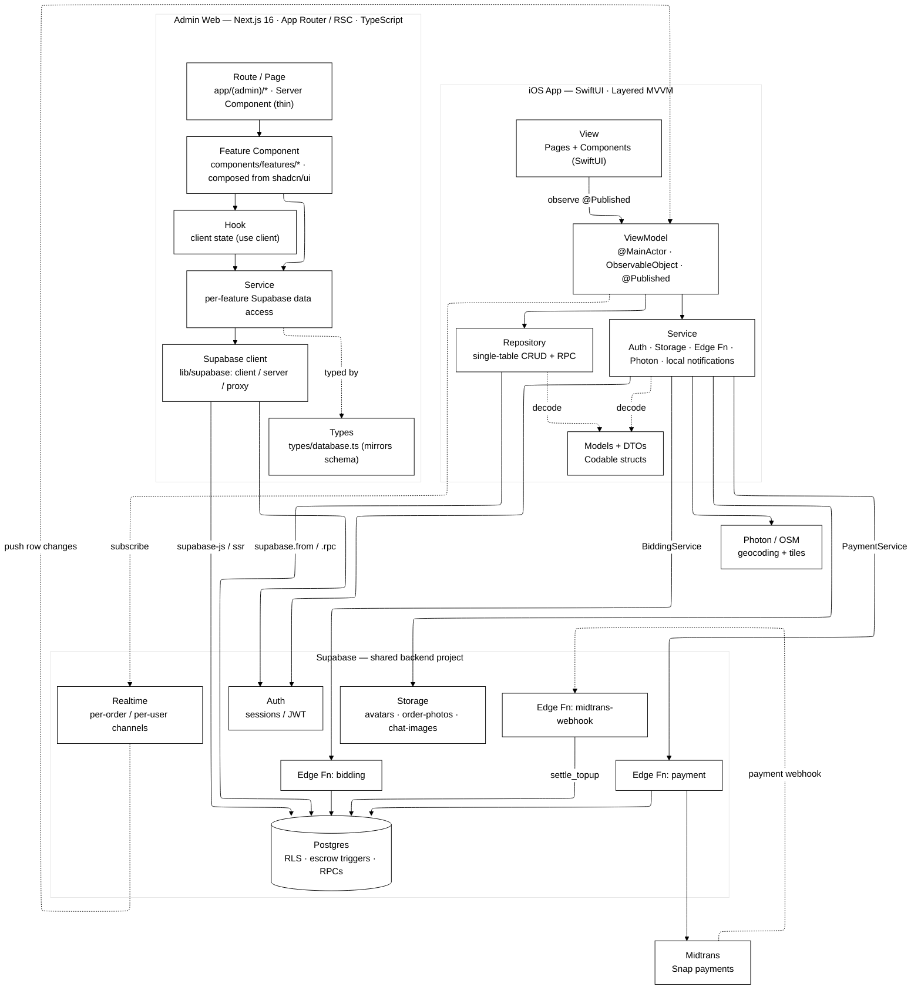

# BengkelIn — System Architecture

A whole-app architecture view: the **three deployables that share one Supabase project**, the iOS app's **layered MVVM** flow, the backend surface, and the external services. Rendered in plain **black & white**.

**Arrows**: solid `-->` = a call / data flow · dashed `-.->` = realtime subscription or async callback (webhook).

## How to read it

- **Three deployables, one backend.** The **iOS app** and the **Admin Web** are separate clients that talk to the **same Supabase project** — no separate API server; Supabase *is* the backend.
- **The MVVM rule (iOS):** `View → ViewModel → Repository | Service → Supabase`. ViewModels never touch Supabase directly **except realtime** — they subscribe to channels themselves (the dashed `ViewModel ↔ Realtime` link).
- **The web architecture (Admin):** feature-based Next.js App Router — `Route/Page (RSC) → Feature Component (shadcn/ui) → Hook | Service → Supabase client → Supabase`. Pages are thin (routing only); each feature owns its components/hooks/services/types under `components/features/<feature>/`; data access goes through the `lib/supabase` client factories (`client` for the browser, `server` for RSC). It's the web analogue of the iOS layering: **Component ≈ View, Hook+Service ≈ ViewModel+Repository, database.ts ≈ Models/DTOs.**
- **Repository vs Service:** Repositories do single-table CRUD + RPCs against Postgres (`supabase.from / .rpc`); Services do non-table work — Auth, Storage, the `bidding` / `payment` **edge functions**, Photon geocoding, and **local notifications** (`UNUserNotificationCenter`, fired on-device when realtime events arrive — no APNs / remote push).
- **Money is server-side.** The client never moves money: `PaymentService → payment` edge fn returns a Midtrans Snap URL; after the user pays, **Midtrans calls the `midtrans-webhook`** edge function, which alone runs `settle_topup` on Postgres. Escrow itself lives in Postgres **triggers**, not the client.
- **External services:** Photon/OSM (maps + geocoding) and Midtrans (payments) — only two. Notifications are local on-device, not a remote service.
