# BengkelIn — Per-Feature Class Diagrams

Class diagrams for the iOS app (`BengkelIn_SE/`), split by feature. Each section is an independent, directly-renderable Mermaid `classDiagram` showing that feature's ViewModels, the Repositories/Services they depend on, and the Models/DTOs that flow through them.

**Layers** (identify by class-name suffix / annotation): `*ViewModel` = ViewModel · `*Repository` = Repository · `*Service` = Service · `*Payload`/`*Params`/`*Request`/`*Response` = DTO · `<<interface>>` = Protocol · `<<enumeration>>` = Enum · everything else = Model.

**Arrows**: `..>` depends on / uses · `-->` association · `*--` composition · `..|>` realizes interface.

> All ViewModels are `@MainActor ObservableObject`; properties shown are `@Published` state. Repositories/Services are stateless. See the root `CLAUDE.md` for the layering rules.

---

## 0. Feature Map (Overview)

One box per feature instead of per class — the whole app at a glance, following the order lifecycle. Use this as the intro slide; the per-feature class diagrams (§1–§11) drill into each box. Solid arrows = the main flow; dashed = money/escrow effects that the Postgres triggers enforce server-side.

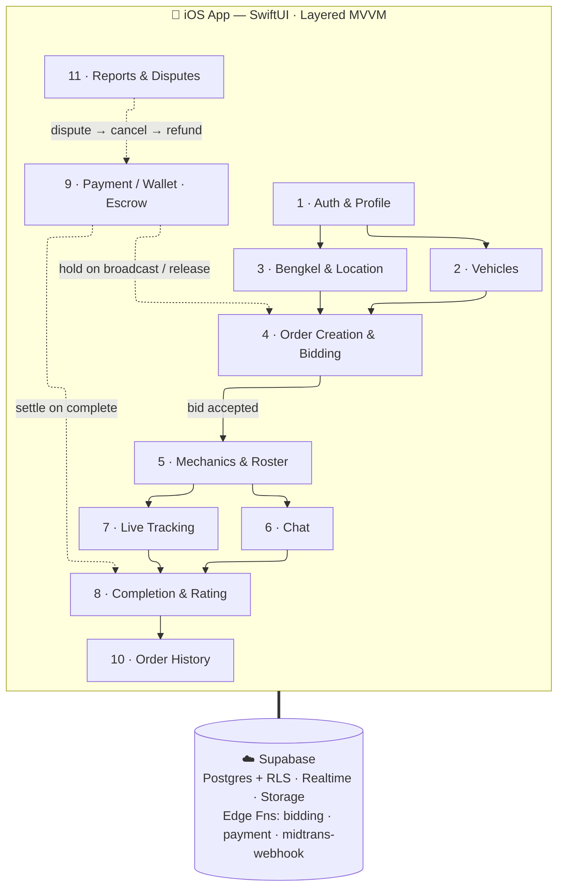

---

## 1. Authentication & Profile

Login, sign-up, session, account deletion, and profile/avatar editing. `AuthViewModel` is created once in `ContentView` and owns `appMode` (which dashboard renders).

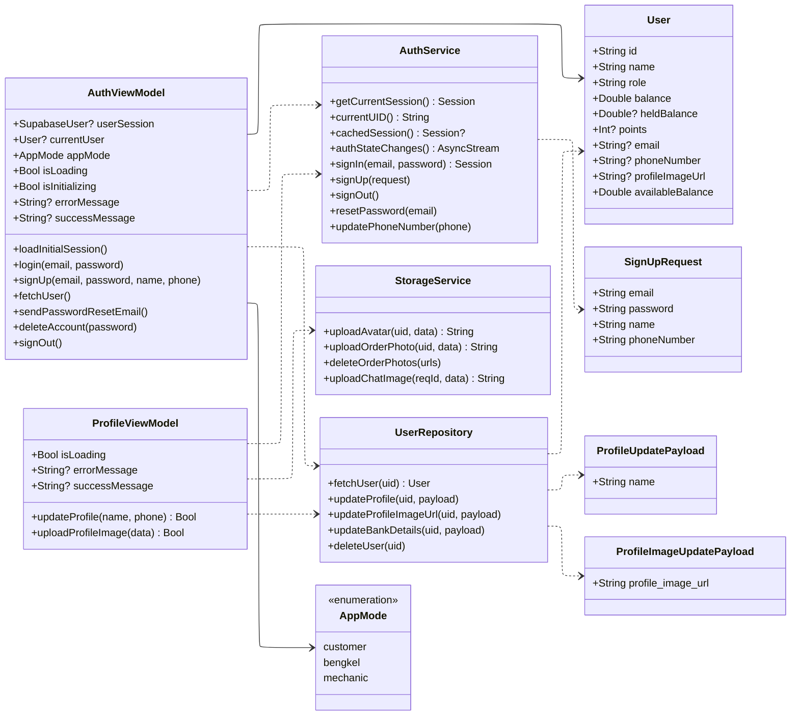

---

## 2. Vehicles

Customer CRUD over their vehicles (used later when creating an order).

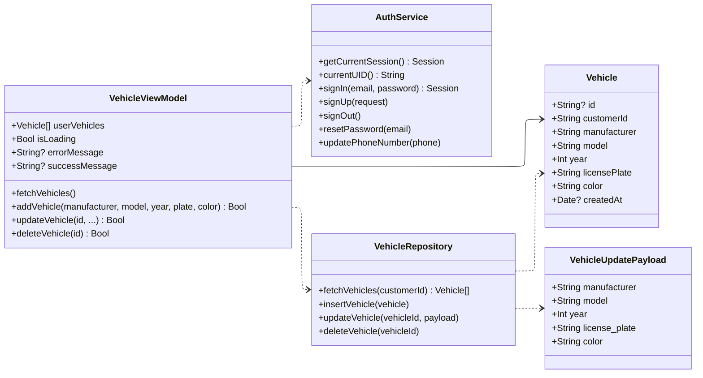

---

## 3. Bengkel (Workshop) Management & Location Picking

Register/edit a workshop, manage its offered services, and the OSM + Photon map/search stack. `BengkelViewModel` realizes `LocationSearchable`.

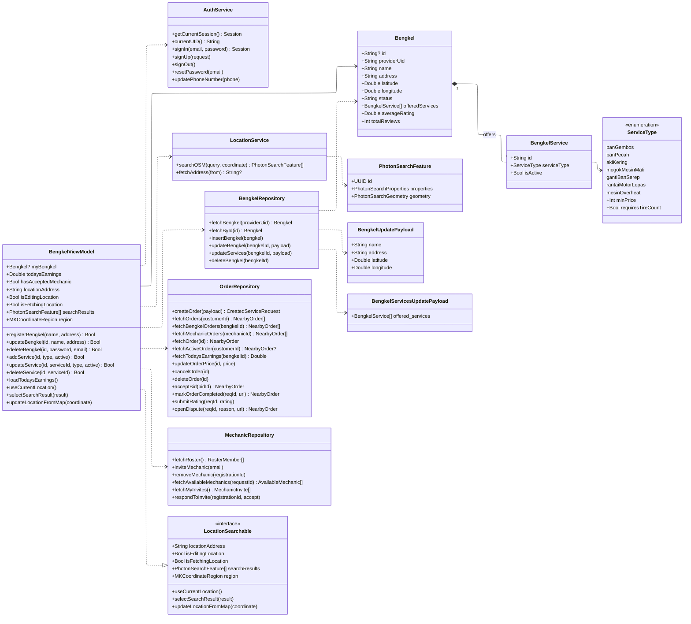

---

## 4. Order Creation & Bidding

The core marketplace loop. The customer composes a request (`OrderViewModel`), broadcasts it and reviews incoming bids (`CustomerBiddingViewModel`); bengkels see nearby open orders and place bids (`BengkelBiddingViewModel`). The `bidding` edge function (`BiddingService`) geo-filters orders and writes bids server-side. Class members here are complete: `+` = public (`@Published` state / public methods), `-` = private implementation state and helpers.

```mermaid
---
config:
  layout: elk
  elk:
    nodePlacementStrategy: LINEAR_SEGMENTS
    mergeEdges: false
---
classDiagram
    direction LR

    class AuthService {
        +getCurrentSession() Session
        +currentUID() String
        +cachedSession() Session?
        +authStateChanges() AsyncStream
        +signIn(email, password) Session
        +signUp(request)
        +signOut()
        +resetPassword(email)
        +updatePhoneNumber(phone)
    }
    class StorageService {
        +uploadAvatar(uid, data) String
        +uploadOrderPhoto(uid, data) String
        +deleteOrderPhotos(urls)
        +uploadChatImage(reqId, data) String
    }
    class LocationService {
        +searchOSM(query, coordinate) PhotonSearchFeature[]
        +fetchAddress(from) String?
    }
    class NotificationService {
        +requestAuthorization()
        +notifyNewOrder(title, body)
    }
    class BiddingService {
        +fetchOrdersForMechanic(lat, lon, radius) NearbyOrder[]
        +placeBid(reqId, bengkelId, price, notes) Bid
    }
    class UserRepository {
        +fetchUser(uid) User
        +updateProfile(uid, payload)
        +updateProfileImageUrl(uid, payload)
        +updateBankDetails(uid, payload)
        +deleteUser(uid)
    }
    class VehicleRepository {
        +fetchVehicles(customerId) Vehicle[]
        +insertVehicle(vehicle)
        +updateVehicle(vehicleId, payload)
        +deleteVehicle(vehicleId)
    }
    class BengkelRepository {
        +fetchBengkel(providerUid) Bengkel
        +fetchById(id) Bengkel
        +insertBengkel(bengkel)
        +updateBengkel(bengkelId, payload)
        +updateServices(bengkelId, payload)
        +deleteBengkel(bengkelId)
    }
    class OrderRepository {
        +createOrder(payload) CreatedServiceRequest
        +fetchOrders(customerId) NearbyOrder[]
        +fetchBengkelOrders(bengkelId) NearbyOrder[]
        +fetchMechanicOrders(mechanicId) NearbyOrder[]
        +fetchOrder(id) NearbyOrder
        +fetchActiveOrder(customerId) NearbyOrder?
        +fetchTodaysEarnings(bengkelId) Double
        +updateOrderPrice(id, price)
        +cancelOrder(id)
        +deleteOrder(id)
        +acceptBid(bidId) NearbyOrder
        +markOrderCompleted(reqId, url) NearbyOrder
        +submitRating(reqId, rating)
        +openDispute(reqId, reason, url) NearbyOrder
    }
    class BidRepository {
        +fetchAcceptedBid(serviceRequestId) Bid?
        +fetchBids(serviceRequestId) Bid[]
        +fetchBidsForBengkel(bengkelId) Bid[]
        +updateStatus(bidId, status)
    }
    class MechanicRepository {
        +fetchRoster() RosterMember[]
        +inviteMechanic(email)
        +removeMechanic(registrationId)
        +fetchAvailableMechanics(requestId) AvailableMechanic[]
        +fetchMyInvites() MechanicInvite[]
        +respondToInvite(registrationId, accept)
    }
    class NearbyOrder {
        +String id
        +String customerId
        +String? customerName
        +String? serviceType
        +String? description
        +Bool? isEmergency
        +Double latitude
        +Double longitude
        +Int? price
        +String status
        +Int? tireCount
        +String[]? photoUrls
        +String? vehicleId
        +String? vehicleInfo
        +String? bengkelId
        +String? mechanicId
        +Int? rating
        +Bool? customerCompleted
        +Bool? providerCompleted
        +String? completionPhotoUrl
        +Bool? usePoints
        +Int? pointsUsed
        +Int? pointsEarned
        +String? createdAt
        +String? assignedAt
        +Double? distanceM
    }
    class Bengkel {
        +String? id
        +String providerUid
        +String name
        +String address
        +Double latitude
        +Double longitude
        +String status
        +BengkelService[] offeredServices
        +Double averageRating
        +Int totalReviews
        +Date? createdAt
    }
    class OrderViewModel {
        +String locationAddress
        +String? selectedService
        +Int estimatedPrice
        +Bool isFetchingLocation
        +Bool isEditingLocation
        +PhotonSearchFeature[] searchResults
        +String? errorMessage
        +Int tireCount
        +Data?[] photosData
        +ServiceType? pendingServiceType
        +Int pendingTireCount
        +String[] pendingPhotoUrls
        +Bool navigateToBidding
        +LoadingPhase loadingPhase
        +Vehicle[] vehicles
        +String? selectedVehicleId
        +String? pendingVehicleId
        +String? pendingVehicleInfo
        +Bool usePoints
        +Int availablePoints
        +Bool showPointsPrompt
        +Bool hasResolvedLocation
        +MKCoordinateRegion region
        +Int maxRedeemablePreview
        +Bool requiresTireCount
        +String[] services
        +CLLocationCoordinate2D defaultCenter
        -CLLocationManager locationManager
        -Set~AnyCancellable~ cancellables
        +init()
        +selectSearchResult(result)
        +useCurrentLocation()
        +locationManagerDidChangeAuthorization(manager)
        +locationManager(manager, didUpdateLocations)
        +locationManager(manager, didFailWithError)
        +updateLocationFromMap(coordinate)
        +loadVehicles()
        +loadUserPoints()
        +prepareForNewOrder()
        +selectService(service)
        +setTireCount(count)
        +createOrder()
        +retryOrder()
        +beginOrder(usePoints)
        +cancelLoading()
        -searchOSM(query)
        -fallBackToDefaultLocation()
        -fetchAddress(coordinate)
        -calculateEstimate()
        -validateOrder() Bool
    }
    class CustomerBiddingViewModel {
        +Bid[] bids
        +Bid? acceptedBid
        +Bool isLoading
        +Bool isStartingSearch
        +String? errorMessage
        +LoadingPhase loadingPhase
        +Int minPrice
        +Int customerBidPrice
        +Bool isSearching
        +String? serviceRequestId
        +Double balance
        +Bool showRetryPrompt
        +Bool shouldDismiss
        +Int searchSecondsRemaining
        +Int searchTotalSeconds
        +Double searchProgress
        +ServiceType serviceType
        +Double latitude
        +Double longitude
        +Int tireCount
        +String[] photoUrls
        +String? vehicleId
        +String? vehicleInfo
        +Bool usePoints
        -UInt64 searchTimeoutSeconds
        -UInt64 decisionTimeoutSeconds
        -TimeInterval bidDecisionWindowSeconds
        -Task? searchCountdownTask
        -Task? decisionCountdownTask
        -Task? bidExpiryTask
        -RealtimeChannelV2? realtimeChannel
        -Task[] realtimeReaderTasks
        -Set~String~ knownBidIds
        -Bool didLoadBidsOnce
        +init(serviceType, latitude, longitude, tireCount, photoUrls, vehicleId, vehicleInfo, usePoints)
        +init(resuming)
        +deinit()
        +resume()
        +startSearch(price)
        +retrySamePrice()
        +raisePrice()
        +cancel()
        +cancelAndDelete()
        +startRealtimeSubscription()
        +stopRealtimeSubscription()
        +loadReceivedBids()
        +refresh()
        +acceptBid(bid)
        +rejectBid(bid)
        +expireBid(bid)
        +parseISODate(s) Date?
        -startSearchCountdown()
        -expireSearch()
        -stopSearchingState()
        -scheduleBidExpiry()
        -expireOverdueBids()
    }
    class BengkelBiddingViewModel {
        +NearbyOrder[] orders
        +Bengkel? myBengkel
        +Bid[] myPendingBids
        +Bool isLoading
        +String? errorMessage
        +String? successMessage
        +NearbyOrder? newOrderAlert
        +String? lostBidAlert
        +String? expiredBidAlert
        +NearbyOrder? activeBengkelOrder
        +String? rejectedBidAlert
        +String? orderUnavailableAlert
        +Bid[] myRejectedBids
        +Bool hasMechanics
        -RealtimeChannelV2? realtimeChannel
        -Task[] realtimeReaderTasks
        -Set~String~ knownOrderIds
        -Dictionary~String,String~ bidStatusById
        -Bool didInitialLoad
        -Bool hasStarted
        -String? providerUid
        +deinit()
        +start()
        +reset()
        +refreshOnForeground()
        +startRealtimeSubscription()
        +stopRealtimeSubscription()
        +loadOrders()
        +placeBid(order, price, notes)
        +handleExpiredOrder(order)
        +expireBid(bid)
        +rejectBid(bid)
    }
    class Bid {
        +String id
        +String serviceRequestId
        +String providerUid
        +String bengkelId
        +Int price
        +String? notes
        +String status
        +String? createdAt
        +Bengkel? bengkel
    }
    class ServiceRequestPayload {
        +String customer_id
        +ServiceType service_type
        +String description
        +Double latitude
        +Double longitude
        +Int price
        +Bool is_emergency
        +String status
        +Int tire_count
        +String[]? photo_urls
        +String? vehicle_id
        +String? vehicle_info
        +Bool use_points
    }
    class PlaceBidRequest {
        +String action
        +String serviceRequestId
        +String bengkelId
        +Int price
        +String? notes
    }
    class AcceptBidParams {
        +String p_bid_id
    }

    OrderViewModel ..> OrderRepository
    OrderViewModel ..> LocationService
    OrderViewModel ..> StorageService
    OrderViewModel ..> UserRepository
    OrderViewModel ..> VehicleRepository
    OrderViewModel ..> AuthService
    CustomerBiddingViewModel ..> OrderRepository
    CustomerBiddingViewModel ..> BidRepository
    CustomerBiddingViewModel ..> UserRepository
    CustomerBiddingViewModel ..> StorageService
    CustomerBiddingViewModel ..> NotificationService
    CustomerBiddingViewModel ..> AuthService
    CustomerBiddingViewModel --> Bid
    BengkelBiddingViewModel ..> OrderRepository
    BengkelBiddingViewModel ..> BidRepository
    BengkelBiddingViewModel ..> BiddingService
    BengkelBiddingViewModel ..> BengkelRepository
    BengkelBiddingViewModel ..> MechanicRepository
    BengkelBiddingViewModel ..> NotificationService
    BengkelBiddingViewModel ..> AuthService
    BengkelBiddingViewModel --> NearbyOrder
    OrderRepository ..> ServiceRequestPayload
    OrderRepository ..> NearbyOrder
    OrderRepository ..> AcceptBidParams
    BidRepository ..> Bid
    BiddingService ..> PlaceBidRequest
    BiddingService ..> NearbyOrder
    Bid --> "0..1" Bengkel : bengkel

```

---

## 5. Mechanics & Roster

Bengkel-side roster management (invite/remove mechanics, dispatch a mechanic to an accepted job) and mechanic-side invites + assigned jobs. All roster operations go through RPCs.

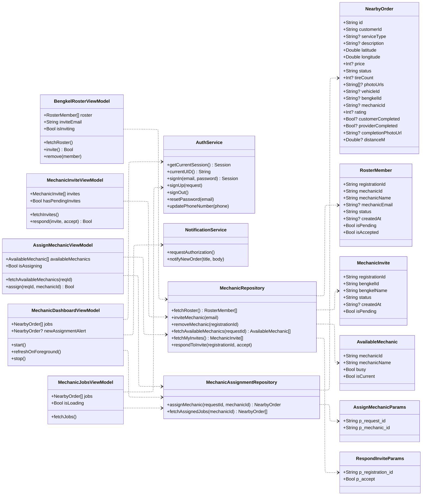

---

## 6. Chat

Realtime per-order chat with text + image messages, an unread watcher, and a lock state (chat closes when the order ends). `ChatReadCursor`/`ChatPresence` are local helpers.

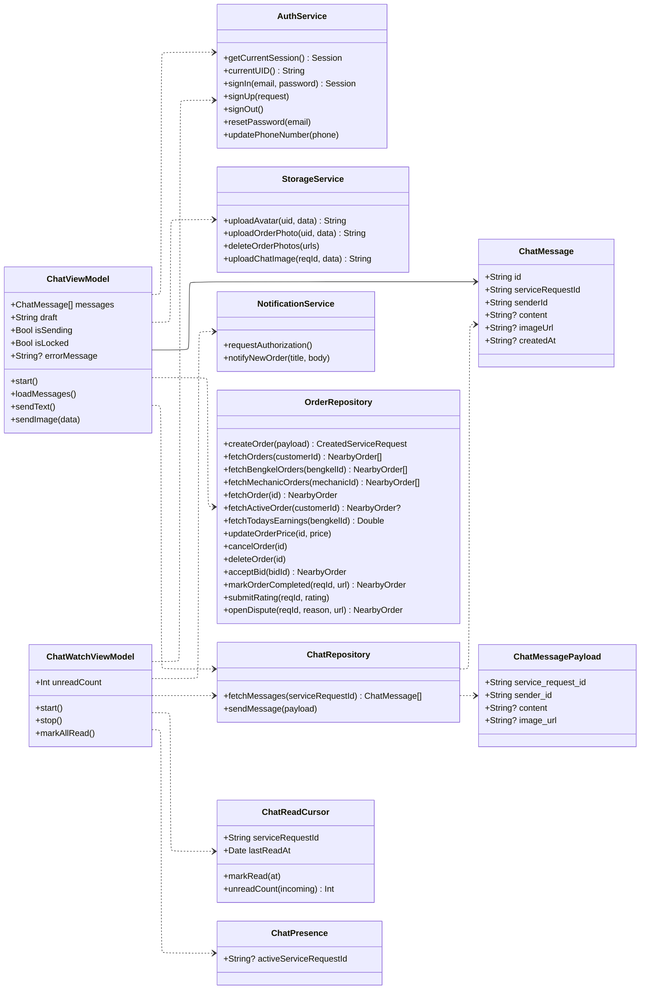

---

## 7. Live Location Tracking

The mover (provider/mechanic) publishes GPS to `order_locations`; the customer publishes to `customer_locations`; the other side subscribes. `BengkelRouteViewModel` drives the provider/mechanic route map; `OrderTrackingViewModel` the customer tracking map. These VMs own a `CLLocationManager`.

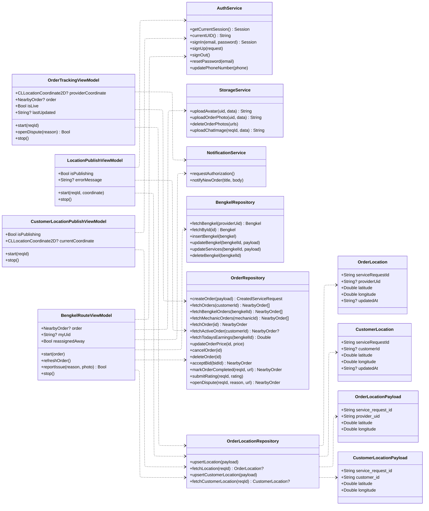

---

## 8. Order Completion & Rating

Dual-confirm completion with a mandatory provider proof photo (`mark_order_completed` RPC), then a write-once customer rating (`rate_order` RPC) that recomputes the bengkel's average. `OrderCompletionViewModel` watches the order over a realtime channel (`order-completion-<reqId>`) and fires a local notification when the counterpart marks their side done. Class members here are complete: `+` = public (`@Published`/computed state and public methods), `-` = private implementation state and helpers.

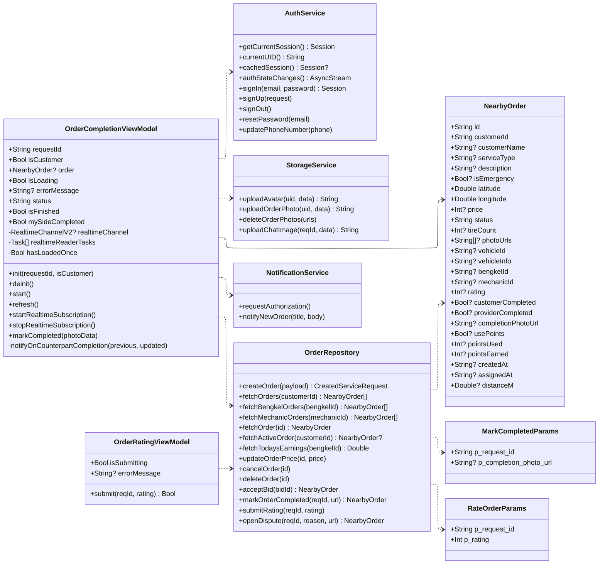

---

## 9. Payment / Wallet (Top-up & Withdrawal)

Wallet balance + points, Midtrans Snap top-up (via the `payment` edge function → `PaymentService`), bank-detail management, and withdrawals (`request_withdrawal` RPC, backed by *available* balance). Settlement happens server-side via the `midtrans-webhook` — never on the client.

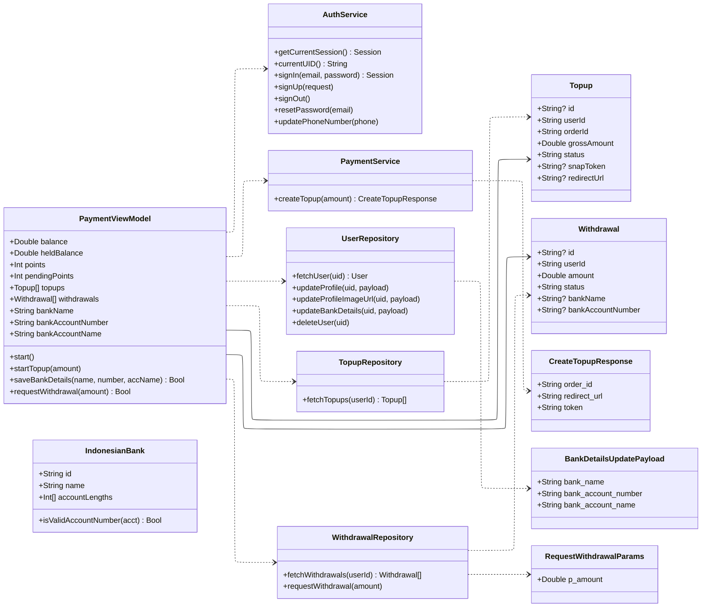

---

## 10. Order History

Per-role history tabs (customer / bengkel / mechanic), each loading completed/past orders and surfacing detail, re-tracking, and "already reported" state. Class members here are complete: `+` = public (`@Published` state / public methods), `-` = private implementation state and helpers.

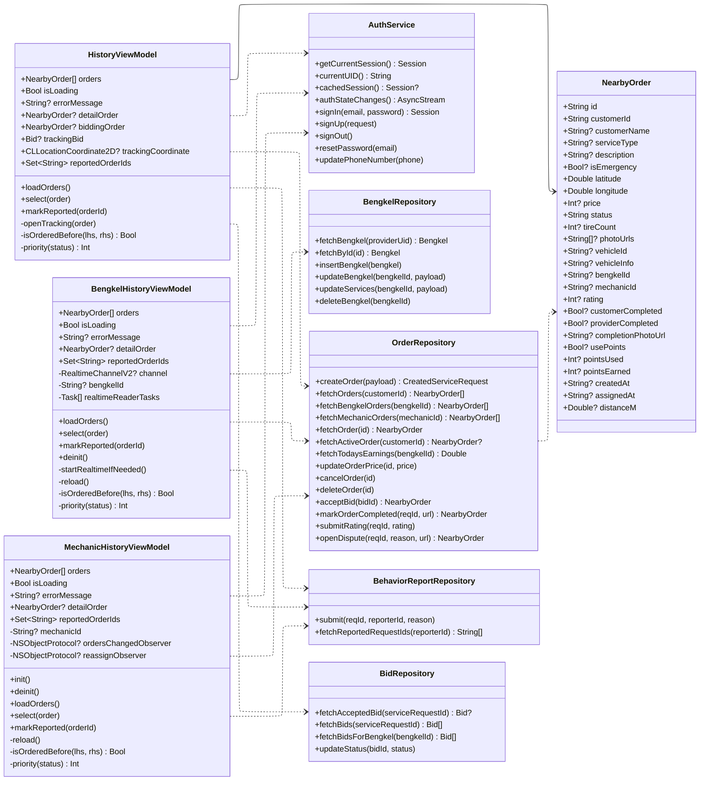

---

## 11. Behavior Reports & Disputes

Report the counterparty's behavior on an order (one report per reporter per order). A dispute on an in-progress order is filed via `OrderRepository.openDispute` (which cancels → escrow refunds); the report itself goes through `BehaviorReportRepository`.

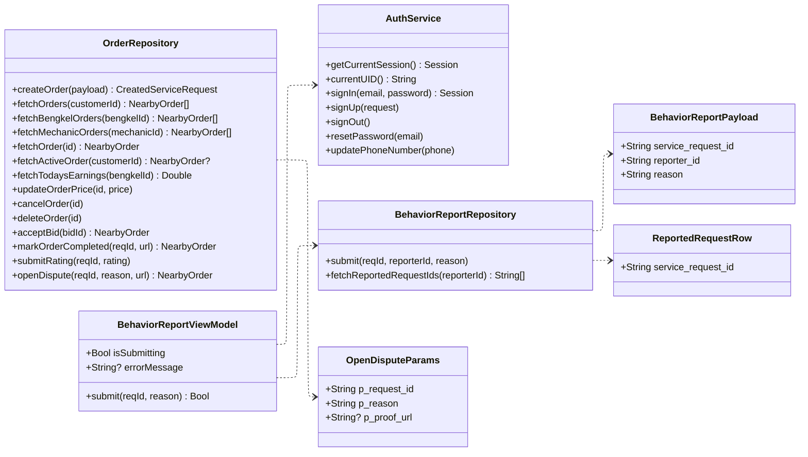

---

### Shared types referenced across features

`NearbyOrder` (the `service_requests` row) and `AuthService` appear in almost every feature — `NearbyOrder` is the central "order" entity that bidding, mechanics, tracking, completion, and history all revolve around. `Bengkel`/`BengkelService`/`ServiceType` are detailed in **§3**; `Bid` in **§4**.
